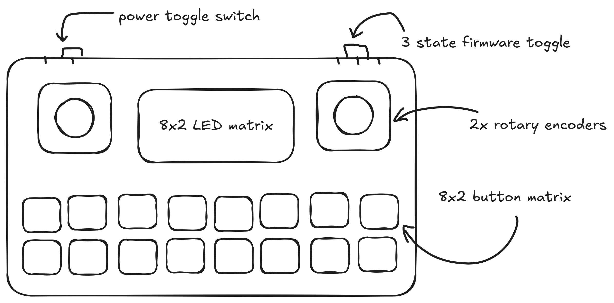

# pocket-midi



A pocket-sized MIDI controller based on the RP2350 MCU, using the Seeed Studio XIAO RP2350. Built with FreeRTOS, TinyUSB, and pico-sdk. A Pico 2 is used as a development board — it shares the same MCU.

I've been using VCV Rack to test the MIDI interface here, checkout [patches](./patches/) for examples.

## dependencies
- `arm-none-eabi-gcc`
- `cmake`
- `picotool`
- pico-sdk with `PICO_SDK_PATH` set

## how to build
```
git submodule update --init
cmake -B build -DPICO_BOARD=seeed_xiao_rp2350
cmake --build build
```

## stdout: serial monitor over USB

The device enumerates as a composite USB **MIDI + CDC** device, so you get MIDI
and a serial monitor over the same USB-C cable in one session — no serial
adapter needed. stdout goes through the CDC interface via a custom TinyUSB stdio
driver (`src/main.c`).

View output with `tio`: `tio /dev/ttyACM0`.

## how to flash
Hold BOOTSEL, plug into your computer, mount the `RP2350` volume, and copy the `.uf2` file from `build/` onto the drive.

## project status
| phase | description | status |
| --- | --- | --- |
| 1 | build tooling, FreeRTOS booting, USB descriptors, MIDI enumeration | done |
| 2 | input subsystem: MCP23017, buttons, encoders | in progress |
| 3 | LED subsystem: IS31FL3731, PWM | not started |
| 4 | integration: full interface count, I2C bus test | not started |
| 5 | hardware design: KiCad schematic, BOM, layout | not started |
